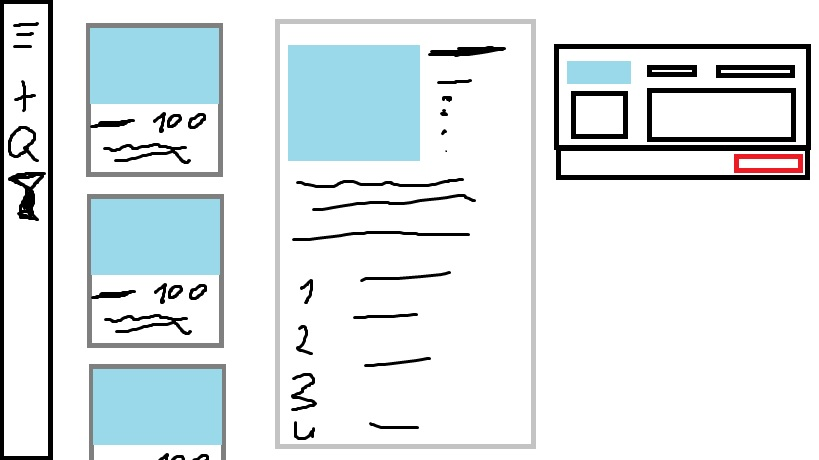

# ИС "Кулинарная книга"

1. Боковой сайд бар с кнопками:

    * [x] Свернуть/Развернуть сайд бар
    * [ ] Добавить новый рецепт
    * [ ] Поиск по рецептам
    * [ ] Фильтр по рецептам

2. Карточки с быстрым обзором блюда:
    
    * [x] Вверху изображение приготовленного блюда (60% карточки)
    * [x] Название блюда, цена (исходя из суммы ингредиентов) и описание блюда (неполлное)

3. Щелчок на карточку активизирует новую форму с полным описание рецепта:
    
    * [ ] Кнопка "Назад" и "Редактировать"
    * [x] Изображение блюда
    * [x] Список ингредиентов
    * [x] Полное описание блюда
    * [x] Пошаговое руководство по приготовлению
    
4. Щелчок по кнопке редактирования на форме с полным описанием рецепта активизирует новую форму:

    * [ ] С кнопкой для добавления изображения
    * [ ] Полем для ввода названия блюда
    * [ ] Полем для цены блюда
    * [ ] Полем для воода ингредиентов
    * [ ] Полем для ввода полного описания блюда
    * [ ] Полем для пошагового руководства по приготовлению
    
---
### Макет приложения

